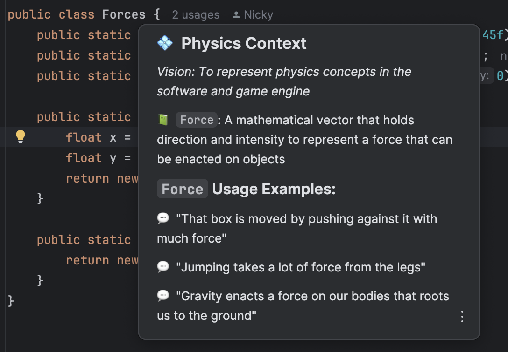

# Experiment: Simple Simulation Engine

> 
> During a talk of Tom Cools (Learning through tinkering), I wanted to test the building of a little
> physics simulator that acts with gravity and other forces. Being a physics nerd, this interested me immediately. 
> So enjoy my code and learning progress.
> 
> Created: Nick Bauters

## Table of Content

- [Simulation Engine](#simulation-engine)
- [Installing and Running the simulation](#installing-and-running-the-simulation)
- [Development of the simulation](#development-of-the-simulation)
  - [Common / Ubiquitous language](#common-language)
  - [Features](#features)
- [extra resources](#sources)

## Simulation Engine

The simulation engine I rebuild with the guidance of Tom's code can be found in the package simulatorEngine.
This is based on a blog post, that unfortunately has been lost in time.

The `engine` contains the framework to make the simulator work.
- `simulator` contains the basic interfaces to work with and the JavaFX implementation we are using to create the simulation UI
- `physics` contains all the basic interfaces and custom implementations to make physics work in the simulator engine

## Installing and running the simulation

### With Maven

Open the project and run the following command:
```shell
mvn clean javafx::run
```

This will compile and package the code and use the maven plugin provided in the POM to run the code as a JavaFX application.
The application will open in full screen and show the current build UI.

To stop the run, you simple pres `ctrl + c` in the terminal to terminate the process.

## Development of the simulation

### Common language

To make sure we use and understand the language used in our code, we use contextive to document the used words and terms.
You can find these descriptions and terms in the [Contextive Definitions file](.contextive/definitions.yml).

If you have the Contextive plugin installed, after building the project
using: 
```shell
mvn clean package
```   
the plugin will start providing aid when typing or reading the code within the application. 
Simple hover over the word you want to understand, and you will receive an explanation with examples.



### Features

This simulator has the following short roadmap and feature list:

- [x] a simple, not interactable, UI canvas framework for Desktop UI
- [ ] a physics engine
  - [ ] 2 Dimensional
    - [x] Coordinate system
    - [x] Vector calculation
    - [ ] Forces
      - [x] Gravity
      - [ ] Static Friction
      - [ ] Dynamic Friction
      - [ ] Non axis force calculation
  - [ ] 3 Dimensional
    - [ ] Coordinate system
    - [ ] Vector calculation
    - [ ] Forces
      - [ ] Non axis force calculation


## Sources

- Original Talk: [Learning Through Tinkering by Tom Cools on Jfokus](https://www.youtube.com/watch?v=Ida-awHnrPY)
- The original engine from Tom: [Tom Cools Java FX Game Experiments](https://github.com/TomCools/JavaFXGameExperiments)
- The nature of code - video list: [The Nature of Code - Coding train](https://www.youtube.com/watch?list=PLRqwX-V7Uu6akvoNKE4GAxf6ZeBYoJ4uh)
- More info on Contextive: [Contextive Repository](https://github.com/dev-cycles/contextive)